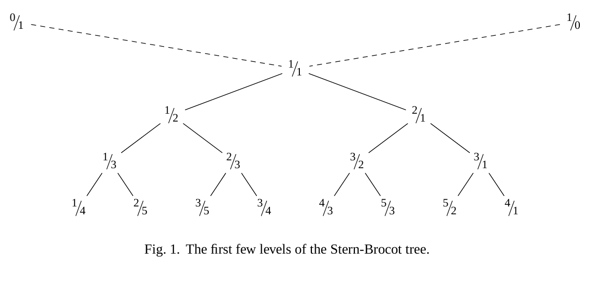
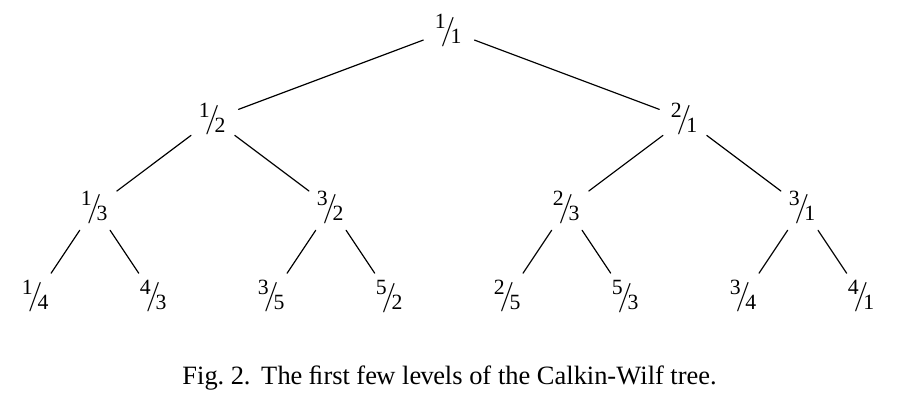

% Enumerating The Rationals
% Wout Elsinghorst, Pepijn Kokke
% June 27th, 2013

## Enumerating The Rationals

- Naive approach
- Reduced rationals
- Stern-Brocot Tree
- Calkin-Wilf Tree
- Deforested Calkin-Wilf
 
## 

  
  
## CoLists and CoTrees

 - CoData
     * CoLists
     
            Cons : (Q, CoList) -> CoList Q
     
     * CoTrees 
 
            Node : (CoTree Q, Q, CoTree Q) -> CoTree Q  
 
            unfold f s = 
              let (x, v, y) = f s
              in Node (unfold f x, v, unfold f y)

 
## Naive Approach
 -  step : Q -> (Q, Q, Q)

    step $\frac{n}{d}$ = ($\frac{n+1}{d}$, $\frac{n}{d}$, $\frac{n}{d+1}$)
    
 -  tree : CoTree Q
    
    tree = unfold step 1/1
  
## Reduced rationals
        gcd : Q -> N
        gcd p/q = 
          if m < n then gcd (m, m - n) else
          if m > n them gcd (m - n, n) else m
 
 - `[Bool]`: Finite bit strings, gcd execution traces
 
        igcd : Q -> (N, [Bool])
        igcd p/q =
          if m < n then step True  $ igcd m/(m - n) else
          if m > n them step False $ igcd (m - n)/n else m
             where step b (d, bs) = (d, b : bs)
    
 - pgcd : Q -> [Bool]
        
 - ungcd : (N, [Bool]) -> Q
        
## Reduced rationals (Cont'd)

 - Enumerate all rationals:
     1. Enumerate all bit finite bit strings (without dupes)
     2. Map $\lambda$ p $.$ ungcd (1, p) 
     3. Done
        
## Stern-Brocot Tree
 
 - efficient $trie$ representation of finite bit strings

 - search tree property for every finite pruning

        
## Stern-Brocot Tree (Cont'd)

 -  step : (Q, Q) -> ( (Q, Q), Q, (Q, Q) )
 
    step ($\frac{a}{b}$, $\frac{c}{d}$) = 
        let m = $\frac{a+c}{b+d}$ 
        in ( $\frac{a}{b}$, m), m, (m, $\frac{c}{d}$) )
    
 -  tree : CoTree Q
    
    tree = unfold step ($\frac{0}{1}$, $\frac{1}{0}$)

## Things to prove

 - $\forall q \in Q$ : ungcd (igcd q) $=$ q
    * the process really is reversible
 - $\forall p, q \in Q$ : (pgcd p = pgcd q) $\Rightarrow$ $(p \sim q)$
    * bit string assignment is injective when identifying equivalent fractions
 - $\forall p \in [Bool]$ : `pgcd ( ungcd (1, p) ) = p`
    * every bit string corresponds to at least one fraction
 - $\forall p \in [Bool]$ : `pgcd ( lookup p tree ) = p`
    * every fraction in the tree is at the correct node
    
## Problems with Stern-Brocot Tree

 - Unfolding requires the "pseudo-rationals" $0/1$ and $1/0$ as input;

<!--
  Proving relation between $Q$ reduction and position in the tree
  requires both algorithms to be based on the same implementation
  of `gcd`--but standard implementation does not provide a trace.
  -->

 - Relation between $Q$-reduction and path in the Stern-Brocot tree
   requires both to use equivalent implementations of `gcd`
  
## Conclusion
 - Stuff's hard!
  
    
## Calkin-Wilf Tree

 -  step : Q -> (Q, Q, Q)
   
    step $\frac{m}{n}$ = ($\frac{m}{m+n}$, $\frac{m}{n}$, $\frac{m+n}{n}$)
    
 -  tree : Cotree Q
   
    tree = unfold step $\frac{1}{1}$
    

